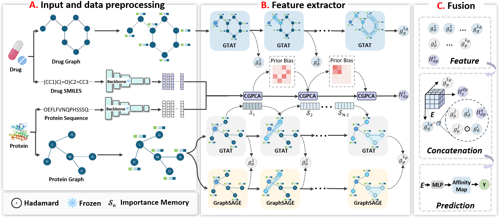

# TopoFuse-DTA

**Dual-Channel Topology-Aware Graph Attention and Cross-Granularity Hierarchical Fusion for Drug–Target Affinity Prediction**

## Overview

TopoFuse-DTA is a hierarchical multi-granularity interaction framework for drug–target affinity (DTA) prediction. It addresses structural role blindness in conventional graph attention and hierarchical information loss from last-layer fusion through two core designs:

- **Dual-channel topology-aware attention** that injects graph-theoretic descriptors into attention weight allocation, restoring structural role discriminability.
- **Cross-granularity co-attention fusion** that retains layer-wise representations and adaptively aggregates all cross-layer combinations via temperature-scaled learnable weights.

## Architecture



## Project Structure

```
TopoFuse-DTA/
├── config.py                           # Hyperparameters and CLI arguments
├── train.py                            # Training entry point
├── models/
│   ├── topofuse_dta.py                 # Main model and Lightning wrapper
│   ├── gtat_conv.py                    # Dual-channel topology-aware convolution
│   ├── blocks.py                       # EnhancedGATBlock, GraphSAGEBlock
│   ├── transformer.py                  # CGPCA TransformerBlock
│   ├── fusion.py                       # CoAttentionLayer, ResidueImportanceEvolution
│   └── layers.py                       # EnhancedSAGEConv
├── data/
│   └── dataset.py                      # DTADataset and DTADataModule
├── utils/
│   ├── metrics.py                      # Evaluation metrics (MSE, CI, r²_m, etc.)
│   └── results.py                      # Result saving and visualization
└── preprocessing/
    ├── build_mol_graph.py              # Drug molecular graph construction
    ├── build_prot_graph.py             # Protein residue graph construction
    └── build_topology.py              # Precomputed topology descriptors
```

## Requirements

- Python ≥ 3.9
- PyTorch ≥ 1.13
- PyTorch Geometric ≥ 2.3
- PyTorch Lightning ≥ 2.0
- RDKit (for molecular graph construction)
- Biopython + DSSP (for protein graph construction)

```bash
pip install -r requirements.txt
```

PyTorch and PyTorch Geometric should be installed following their official guides to match your CUDA version:
- https://pytorch.org/get-started
- https://pytorch-geometric.readthedocs.io/en/latest/install/installation.html

## Preprocessing

```bash
# Step 1: Build molecular graphs from SMILES
python preprocessing/build_mol_graph.py --data_dir data/davis

# Step 2: Build protein residue graphs from PDB files
python preprocessing/build_prot_graph.py \
    --data_dir data/davis \
    --pdb_dir data/davis/pdbs \
    --dssp_bin mkdssp \
    --lookup_dir preprocessing

# Step 3: Compute topology descriptors
python preprocessing/build_topology.py --data_dir data/davis

# Step 4: Extract sequence embeddings (user-provided scripts)
#   ChemBERTa-2 → drug_seq_features.pkl   (768-dim per drug)
#   ESM-C 600M  → protein_seq_features.pkl (1152-dim per protein)
```

## Training

```bash
python train.py \
    --dataset davis \
    --data_dir ./data \
    --batch_size 64 \
    --lr 1e-4 \
    --max_epochs 2000 \
    --gpu 0 \
    --log_dir ./logs
```

## Results

| Method | Davis MSE ↓ | Davis CI ↑ | Davis r²_m ↑ | KIBA MSE ↓ | KIBA CI ↑ | KIBA r²_m ↑ |
|--------|------------|-----------|-------------|-----------|----------|------------|
| GraphDTA | 0.245 | 0.881 | 0.675 | 0.139 | 0.881 | 0.772 |
| MgraphDTA | 0.207 | 0.900 | 0.705 | 0.130 | 0.906 | 0.793 |
| FusionDTA | 0.208 | 0.913 | 0.743 | 0.128 | 0.902 | 0.801 |
| TDGraphDTA | 0.201 | 0.906 | 0.742 | 0.124 | 0.899 | 0.808 |
| MSN-DTA | 0.194 | 0.918 | 0.752 | 0.123 | 0.910 | 0.809 |
| Adaptive-DTA | 0.170 | 0.913 | 0.689 | 0.126 | 0.905 | 0.774 |
| RRGDTA | 0.196 | 0.909 | 0.749 | 0.122 | 0.905 | 0.810 |
| **TopoFuse-DTA** | **0.157** | **0.921** | **0.784** | **0.121** | **0.912** | **0.811** |

## Citation

```bibtex
@article{topofuse-dta-2025,
  title={TopoFuse-DTA: Dual-Channel Topology-Aware Graph Attention and
         Cross-Granularity Hierarchical Fusion for Drug--Target Affinity Prediction},
  author={},
  journal={},
  year={2025}
}
```

## License

This project is licensed under the MIT License.
